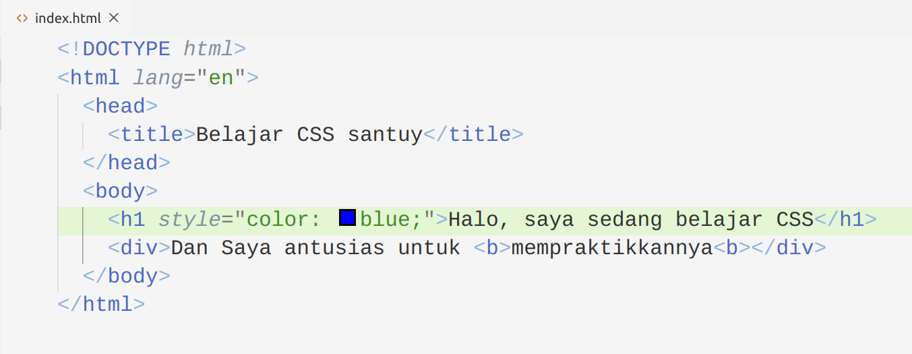
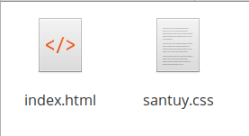
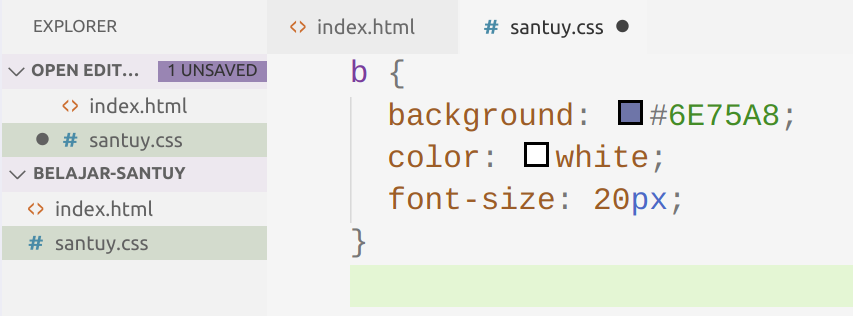

Ada beberapa cara untuk menuliskan CSS, yaitu: Inline Styling, via Style Tag, dan external CSS file. Gimana sih caranya? yuk kita coba satu persatu. Beneran dicoba lho.


## Inline Styling

Pada HTML yang telah kita buat sebelumnya, terdapat tag `<h1>` coba tambahkan inline styling pada tag tesebut.

```html
<!-- file location: belajar-santuy/index.html -->

...
  <h1 style="color: blue;">Halo, saya sedang belajar CSS</h1>
...
```

Jangan bingung dengan titik-titiknya yaa.. itu maksudnya supaya fokus pada tag atau bagian tertentu saja pada file html kita. Kalau versi utuhnya, maka konten dari file HTML teman-teman harusnya seperti gambar di bawah ini:




Coba buka pada browser, maka akan menghasilkan tampilan Heading Text yang berwarna biru. Seperti di bawah ini: 


Selanjutnya, mari kita breakdown, maksud dari masing-masing syntaxnya. 

- `style="value"`: attribute `style` HTML yang memungkinkan kita untuk melakuakn styling pada tag secara langsung. Sedangkan `value` nya adalah syntax CSSnya.
- `color`: salah satu **property** yang ada di CSS. Fungsinya untuk memberi warna pada text.
- `blue`: value dari property `color`. property `color` menerima value warna yang berupa text ataupun hex code. misal: `#000000`. 


Gimana udah mulai bingung? gapapa... namanya juga belajar, pelan-pelan pemahannnya akan bertambah. Semangat terus yak.


## Style Tag

Selain melakukan styling secara langsung pada tag HTML, kita juga bisa menggunakan tag `<style>`. apa dan gimana sih tag `<style>` itu? yuk kita coba praktikkan.

Pada HTML yang telah kita buat sebelumnya, terdapat tag `<head>` coba tambahkan tag `<style>` di dalam tag `<head>` tersebut. Seperti ini:


```html
<!-- file location: belajar-santuy/index.html -->

...
  <head>
    <title>Belajar CSS santuy</title>
    <style>
      b {
        background: #6E75A8;
        color: white;
        font-size: 20px;
      } 
    </style>
  </head>
...
```

> Tampilan ketika di browser

 

Yuk kita breakdown lagi masing-masing syntaxnya.

- `<style>...</style>`: Tag yang digunakan untuk **menuliskan CSS pada file HTML**.
- `b`: **selector** CSS untuk menyeleksi *element* apa yang hendak kita *styling*. Yang di styling pada contoh di atas adalah element `<b>`.
- `{...}`: pembuka dan penutup syntax styling pada masing-masing selector. fungsinya sama seperti tag pembuka dan penutup dari HTML. Tapi ini digunakan untuk CSS.
- `background`: property CSS yang digunakan untuk memberi warna pada latar belakang *element*.
- `#6E75A8`: value dari property `background` yaitu berupa **kode warna** yang ditulis menggunakan *hexcode*.
- `font-size`: property CSS yang digunakan untuk mengatur ukuran text atau font pada laman web. valuenya bukan berupa warna, melainkan angka dalam satuan pixel--Bisa juga dalam satuan yang lain.
- `20px`: value dari property `font-size` yang berupa angka dengan satuan pixel. Tidak harus pixel yaa.. kita juga bisa menggunakan satuan `rem` maupun `em`.


Kali ini lebih menarik karena teman-teman telah berkenalan dengan selector dan lebih banyak lagi `property` CSS dengan `value` selain warna. Kita juga berkenalan dengan angka dengan satuan pixel. Jadi property CSS itu bisa bervariasi value nya. tergantung property nya.


## External CSS File

Dengan menggunakan tag `<style>`, kita telah menuliskan CSS dengan cara yang "lebih rapi". Tapi ada lagi cara yang lebih rapi untuk menuliskan CSS. Tidak hanya rapi, cara ini juga lebih *maintainable*. Yaitu dengan menuliskannya pada file eksternal yang berekstensi `.css`. Yuk praktik lagi yuk.

Buat file kosong, lalu beri nama `santuy.css`.




Lalu isi kontennya dengan syntax CSS seperti di bawah ini:

```css
/* 
  file location: belajar-santuy/santuy.css 
*/

b {                              
  background: #6E75A8;           
  color: white;  
  font-size: 20px;                
}
```

Kalau masih bingung gimana, coba lihat gambar di bawah ini:


Pada file HTML kita, tambahkan tag `<link>` guna menghubungkan antara file HTML dengan file CSS kita.

```html
<!-- file location: belajar-santuy/index.html -->

...
  <head>
    <title>Belajar CSS santuy</title>
    <link rel="stylesheet" href="./santuy.css">
  </head>
...
```

Jangan lupa untuk menghapus tag `<style>` yang telah kita buat pada sub bab sebelumnya. Jika sudah, maka tampilan laman web kita akan tetap seperti sebelumnya.


Lah terus bedanya apa dong? bedanya adalah file CSS kita lebih rapi karena berada di luar file HTML. Coba bayangkan jika kita punya laman web yang konten HTML nya saja sudah panjang, terus mau kita tambahkan file CSS nya juga di dalamnya? maka file kita akan sangat amat panjang sekali. Nah, oleh sebab itu, dengan memisahkan antara file HTML dan CSS, maka file HTML kita gak panjang-panjang amat.


Sudah paham kan bagaimana cara menuliskan CSS? Mari kita lanjut dengan memperdetil pemahaman pada bagian-bagian dari syntax CSS. Skuy lah~
